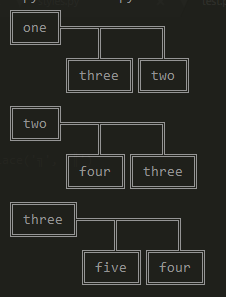
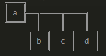
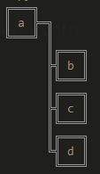
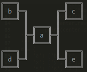
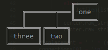

# uuplotter
ascii data plotter

python module to visualise data.

### usage
An example of using the uuplotter module.
```python
import uuplotter

data = {
	'one': ['two', 'three'],
	'two': ['three', 'four'],
	'three': ['four', 'five']
}

plotter = uuplotter.Plotter(data)
for key in plotter.datapoints:
	plotter.center(key)
	plotter.print()

```

### styles
uuplotter uses styles to visualise data sets.

current styles avaliable:

- linear right leaning
<br><br>
- linear trail
<br><br>
- spider
<br><br>
<br><br>

planned styles:

- star